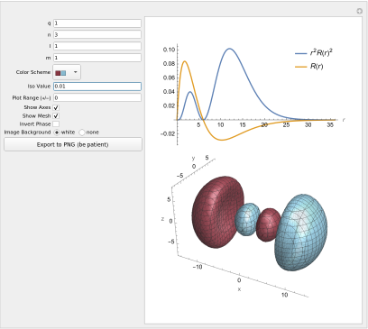

# Plotting orbitals of Hydrogen-like Atoms

File atomic-orbital-plots.nb is a Mathematica notebook for plotting the radial
function, radial density, and +/- 3D isosurfaces of 
of an atomic orbital (hydrogen-like). The screenshot above shows the 
interface in the notebook where you can select the nuclear charge, 
the quantum numbers for the orbital, and other settings. 

Below the graphical output window, the formulas for the radial function
and the complete orbital will also be printed. Instructions are provided
in the notebook.

Mathematica Versions 13.0 and 14.0 are confirmed to work. 
Other versions 12.x and higher likely will work, too. The notebook
should also work with the free Wolfram Player, except for the Export
functionality. 

