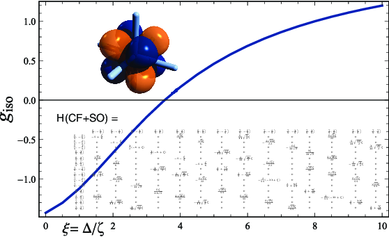

# Crystal field Hamiltonian and atomic shell splitting

A Mathematica notebook for the symbolic calculation of a crystal field Hamiltonian and the spin-orbit coupling Hamiltonian in a basis of atomic orbitals for a given angular momentum ℓ, along with other calculations. Relevant references are these: https://doi.org/10.1002/chem.201705748 , https://doi.org/10.1021/ic501168a , https://doi.org/10.1002/chem.201305039

A description and some examples can be found here: 

https://ja01.chem.buffalo.edu/tutorials/xtalfield.html
