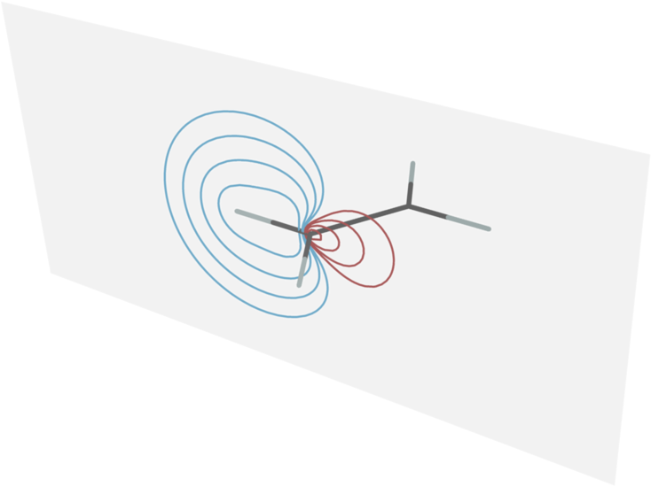
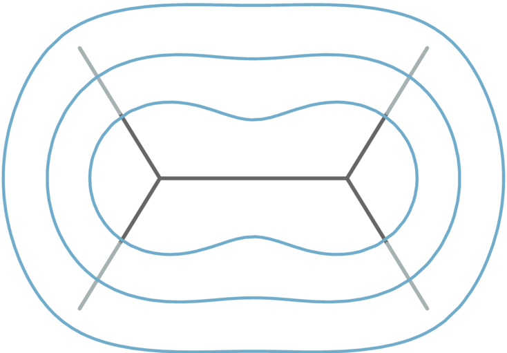
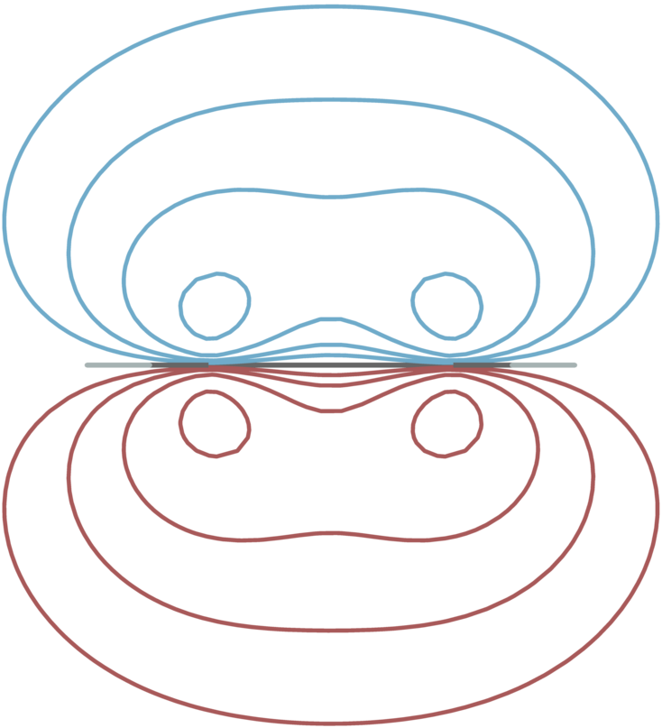

# Plotting molecular orbitals from cube file data in 2D slices (cutplanes)

 

File orbitalplot-2D-slices.nb is a Mathematica notebook for plotting contours of
molecular orbitals in 2D slices (cut-planes). The images above shows contour line plots of one of the C-H bond orbitals and the C-C pi-bond orbital of the ethene molecule, generated with the notebook.

*Notes: Mathematica Versions 12.x, 13.0, 13.3, and 14.0 are confirmed to work. Others likely will.*

An earlier version of this notebook was used to generate 2D cutplane plots of orbitals in the textbook *Molecular Orbitals* by Pierpaolo Morgante and Jochen Autschbach (American Chemical Society, 2023), see https://ja01.chem.buffalo.edu/in-focus-mo-ebook/in-focus-mo-ebook.html and https://pubs.acs.org/doi/book/10.1021/acsinfocus.7e7002

Numerical data for the orbitals must be provided in the form of data files in the commonly used 'cube' format (volume data + molecular frame).

The image in file contours-c2-h6-plane.png was created from c2-h6-bond.cube with settings

    plane = "3-atoms";
    vertices = {2, 6, 7}; 

"Atom 7" was added manually, where indicated in te notebook, as a dummy position to be able to specify a plane perpendicular to the molecular plane.

The image in file contours-cc-pi-above-xy-plane.png was created from c1-c2-pi-bond.cube with settings

    s = {0, 0, 0.5};
    plane = "xy";

The image in file contours-cc-pi-perp-plane.png was created from c1-c2-pi-bond.cube with settings

    s = {0, 0, 0};
    plane = "xz";

Additional code to save the current viewpoint, or to import it from a file saved during another interactive session, can be found in the notebook at https://github.com/jautschbach/mathematica-notebooks folder "cubefile-plot-molecular-orbitals". In the accompanying README.md, there is also information on how to add or delete bonds drawn in the molecule, if Mathematica defaults are not to your liking. 

