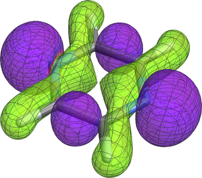
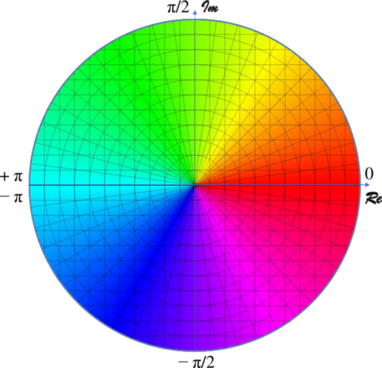

# Plotting complex orbitals from cube file data

A Mathematica notebook for plotting the isosurface of the absolute value
of a complex orbital. The isosurface is colored with the complex phase
of the orbital according to the color wheel shown below. 

*Notes: The notebook should work with Mathematica Versions 12.x and 13.0. In Mathematica 13.1, the combined rendering of molecules and isosurfaces based on cube file imports is broken; do not use. 13.2 should work, but this version generates isosurfaces that appear as if resulting from low-resolution data even if a high-resolution cube file is used. Mathematica 13.3 has a minor glitch in the molecule import, but with a similar workaround as implemented in https://github.com/jautschbach/mathematica-notebooks/tree/main/cubefile-plot-molecular-orbitals/ it should work. Likely, I will not make further updates to this notebook unless required by a new research project*

The functionality in this notebook was used to generate the orbital visuals in this article:

Rulin Feng, Xiaojuan Yu, Jochen Autschbach, Spin-orbit Natural Transition Orbitals and Spin-forbidden Transitions, J. Chem. Theor. Comput., (2021), 12, 7531. https://doi.org/10.1021/acs.jctc.1c00776 

The notebook is also available at the Wolfram Foundation's Notebook
Archive: https://notebookarchive.org/2022-02-471gnt6/

