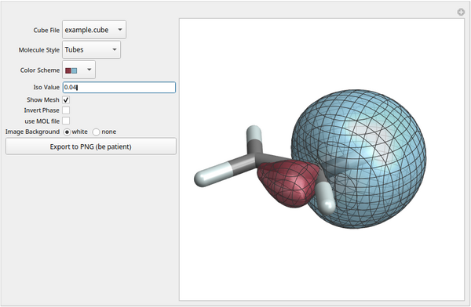

# Plotting molecular orbitals from cube file data

File orbitalplot-interactive.nb is a Mathematica notebook for plotting
+/- isosurfaces of a set of molecular orbitals. The image above shows
+/-0.04 atomic units isosurfaces of a localized molecular orbital
representing one of the C-H bonds in the ethene molecule generated
with the notebook.

Mathematica Versions 12.x, 13.0, 13.3 and Wolfram 14.x are confirmed
to work.  Newer Matematica/Wolfram versions likely will work,
too. There is a variant with `mma12` in the file name that should work
smoothly with 12.x but `orbitalplot-interactive.nb` should run fine
with 12.x, too.

An earlier version of the notebook was used to generate the molecular
orbital visualizations in my textbook *Quantum Theory for Chemical
Applications*
(https://global.oup.com/academic/product/quantum-theory-for-chemical-applications-9780190920807). The
ethene orbital example is one of the isosurface plots shown in Figure
10.12 in the book. See also this article:
https://doi.org/10.1021/ed200673w

Numerical data for the orbitals must be provided in the form of data
files in the commonly used 'cube' format (volume data + molecular
frame).

The grid specifications in the CUBE files must be Cartesian, in the
order x, y, z, and with positive steps; otherwise, the
Mathematica/Wolfram versions that we tested gave errors or generated
an incorrect plot. For Cartesian grids with negative steps or grid
vectors that are not ordered as x, y, z, you can use `manipulatecube
<cubefile> fix` with the manipulatecube code from
https://github.com/jautschbach/manipulatecube
 
The screenshot above shows the main interactive widget of the
notebook. The user can select different styles for plotting the
molecular frame, select the isosurface values, rotate and scale the
plot as desired, and there is a convenient button for saving the plot
in its current orientation in PNG format. If the notebook's directory
contains multiple cube files (they must all be for the same molecule,
using the same grid for the volume data), it can be selected from a
drop-down menu in the plot panel, preserving the viewpoint and other
settings. This is very convenient when one wants to draw many
different orbitals isosurfaces for the same molecule.

There is additional code to save the current viewpoint, or to import
it from a file saved during another interactive session. An
accompanying notebook, `multiple-cube-exports.nb`, is also provided. You
can use said notebook to generate images for a large set of cube files
in one go.

It happens occasionally (esp. for metal complexes, in my experience)
that Mathematica generates too many or too few bond 'sticks' in the
molecule drawing. In this case, please consult the instructions in
`orbitalplot-interactive.nb` as well as the accessory notebook
`import-molecule-modify.nb` (also provided in this repository) how to
create a MOL format file `molecule.mol` with the desired atom
connectivities and use the MOL file in the interactive plot program by
clicking the appropriate option.

