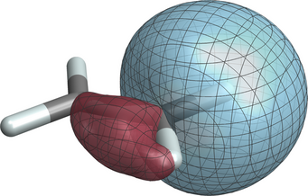

# Plotting molecular orbitals from cube file data

A Mathematica notebook for plotting +/- isosurfaces of 
of a set of molecular orbitals. The image above shows +/-0.04 atomic units isosurfaces of a localized molecular orbital representing one of the C-H bonds in the ethene molecule, generated with the notebook.  

*Notes: Mathematica Versions 12.x, 13.0, and 13.3 are confirmed to work. In Mathematica 13.1, the combined rendering of molecules and isosurfaces based on cube file imports is broken; do not use. 13.2 should work, but this version generates isosurfaces that appear as if resulting from low-resolution data even if a high-resolution cube file is used. Mathematica 13.3 has a minor glitch in the molecule import but with an implemented workaround the notebook works similar to 13.0. Updated versions will be made available as needed, as long as my research group and I continue to use the notebook for our research and educational projects.*

The notebook was used to generate the molecular orbital visualizations in my textbook *Quantum Theory for Chemical Applications* (https://global.oup.com/academic/product/quantum-theory-for-chemical-applications-9780190920807). The ethene orbital example is one of the isosurface plots shown in Figure 10.12 in the book. See also this article: https://doi.org/10.1021/ed200673w 

Numerical data for the orbitals must be provided in the form of data files in the commonly used 'cube' format (volume data + molecular frame).

The screenshot above shows the main interactive plotting panel of the notebook. The user can select different styles for plotting the molecular frame, select the isosurface values, rotate and scale the plot as desired, and there is a convenient button for saving the plot in its current orientation in PNG format. If the notebook's directory contains multiple cube files (they must all be for the same molecule, using the same grid for the volume data), it can be selected from a drop-down menu in the plot panel, preserving the viewpoint and other settings. This is very convenient when one wants to draw many different orbitals isosurfaces for the same molecule. 

There is additional code to save the current viewpoint, or to import it from a file saved during another interactive session.

It happens occasionally (esp. for metal complexes, in my experience) that Mathematica generates too many or too few bond 'sticks' in the molecule drawing. In this case, in the interactive orbital plot notebook, you'd have to open the section at the top

    "Initialization (no need to open unless you get error messages)"
   
by double clicking the cell bracket on the right. Before the line

    molplot = MoleculePlot3D[mol, PlotTheme -> plottheme];
   
you can then do something like this, 
   
    mol1 = MoleculeModify[mol, {"AddBond", {1, 15}}]
    (* 1 and 15 are atom numbers in the XYZ file, adjust as needed *)   

and change 'mol' to 'mol1' in the command

    molplot = ...
   
There is also a command `DeleteBond` if you need it.

When you run the notebook, it saves the molecular structure from the 
cube file(s) in a file named molecule.xyz. To see the list of bonds
generated by Mathematica in reference to the atom numbers, 
you can open a new notebook and enter the command

    BondList[Import["molecule.xyz", "InferBondTypes" -> False]]

For example, Mathematica tends to draw bonds between the metal and some of 
the ligand atoms of organometallic sandwich complexes. 
Having the bond list is then useful if you want to add the missing bonds
or remove them all.

